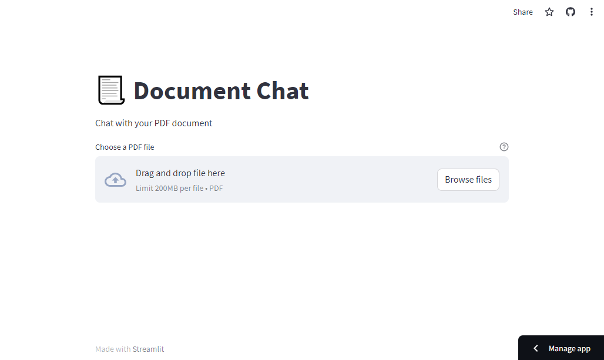

## LLM Apps using Streamlit and LangChain

### Introduction

This repository showcases a suite of experimental LLM applications built using Streamlit.

### Uses

- Streamlit (UI)
- LangChain
- OpenAI API (`gpt-3.5-turbo`)

### Run the App

#### Clone the Repository

```bash
$ git clone github.com/rexsimiloluwah/streamlit-llm-apps
$ cd streamlit-llm-apps
```

#### Install the dependencies

You can advisably create a virtual environment

```bash
$ pip install -r requirements.txt
```

### Run the app

```bash
$ streamlit run src/main.py

# Using make
$ make run-app
```

####

### Example Applications

#### 1. Simple Document QA App

This application enables you to perform question-answering over your PDF document. It uses the `RetrievalQA` chain and the in-memory `DocArray` vector store provided by LangChain.


#### 2. Web Page QA App

This application enables you to perform question-answering over content loaded from a web page. It similarly uses the `RetrievalQA` chain and the in-memory `DocArray` vector store provided by LangChain.


#### 3. Document Chat App

This application enables you to chat over your PDF document. It uses the `ConversationalRetrievalChain` chain and the in-memory `DocArray` vector store provided by LangChain. The memory is managed externally.



